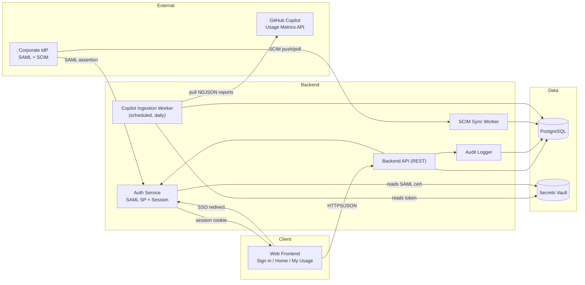

# Architecture: Phase 1 (MVP)

**Companion to:** PRD.md — scope is exactly Phase 1 from §10: Sign in, Home, My Usage, empty search state (wireframe screens 1, 2, 3, 9), daily usage ingestion, derived metrics (non-user, pace, premium-model %), basic audit log. Compare Users, Teams, Department, and alerts (Phase 2+) are out of scope for this document.

## 1. System overview



## 2. Data flows

1. **Identity sync** — IdP → SCIM → Sync Worker → upserts `users` (id, email, manager_id, role). Runs on SCIM push if the IdP supports it, otherwise polls on a schedule.
2. **Sign-in** — user → SAML redirect → IdP → assertion → Auth Service validates → issues session → Frontend.
3. **Usage ingestion (nightly)** — Ingestion Worker calls GitHub's Copilot Usage Metrics API with a server-held, read-only token → downloads the `users-1-day` (and `users-28-day`) NDJSON reports → parses → upserts into `daily_user_usage` → computes derived metrics (non-user flag, pace, premium-model %) → writes `daily_user_derived_metrics`. Re-pulls the last ~5 days each run to absorb GitHub's ~2-day reporting lag and any late corrections — never just "yesterday."
4. **Read path** — Frontend calls Backend API → authorization middleware checks the caller may see the requested user (self, or within the caller's reporting line — recursive check over `users.manager_id`) → query Postgres → Audit Logger records the access → JSON response → Frontend renders Home or My Usage.

## 3. Components & responsibilities

| Component | Responsibility |
|---|---|
| **Web Frontend** | The 4 Phase 1 screens. Talks only to the Backend API — never calls GitHub or the IdP directly. |
| **Auth Service** | SAML Service Provider; validates assertions, issues/revokes sessions. |
| **Backend API** | REST endpoints for `/me`, `/home/summary`, `/users/search`, `/users/{id}/usage`. Owns the authorization/scoping logic. |
| **SCIM Sync Worker** | Keeps `users` (identity + manager attribute) current from the IdP. |
| **Copilot Ingestion Worker** | Scheduled job; only thing in the system that calls GitHub's API; owns NDJSON parsing and derived-metric computation. |
| **Audit Logger** | Writes an append-only row on every access to another person's data, and on role/config changes. |
| **PostgreSQL** | System of record for identity, usage, derived metrics, model-tier mapping, audit log. |
| **Secrets Vault** | GitHub API token (read-only Copilot metrics scope), SAML signing cert, DB credentials. Never touched by the Frontend. |

## 4. Proposed schema (Phase 1)

```
users
  id, email, display_name, manager_id (FK -> users.id, nullable),
  sso_subject, role [admin|manager|ic], created_at, updated_at

daily_user_usage
  user_id (FK), date, ai_credits_used,
  used_completions, used_chat, used_cli, used_coding_agent, used_code_review,
  model_breakdown (JSONB — request counts per model),
  ingested_at
  PK (user_id, date)

daily_user_derived_metrics
  user_id (FK), date,
  is_non_user (bool), credits_projected, credits_allowance,
  pace_status [on_track|trending_over], premium_model_pct
  PK (user_id, date)

model_tier_mapping
  model_name (PK), tier [premium|standard], updated_at, updated_by

audit_log
  id, actor_user_id, action, target_type, target_id,
  occurred_at, metadata (JSONB)
  -- append-only: no UPDATE/DELETE grants at the DB-role level

ingestion_runs
  id, report_type, run_date, status, error_message, completed_at
  -- operational health tracking for the ingestion job
```

`daily_user_usage` and `daily_user_derived_metrics` are split so raw API data and our own computed logic can be reprocessed independently (e.g. if the model-tier mapping changes, we recompute `premium_model_pct` without re-ingesting from GitHub).

## 5. Key architecture decisions

1. **Relational DB (PostgreSQL), not a big-data store.** At 100–1,000 seats × ~90 days of daily rows, this is a few hundred thousand rows — well within normal OLTP territory. No need for a warehouse/OLAP layer in Phase 1.
2. **Precompute derived metrics at ingestion time, not read time.** Non-user flag, pace, and premium-model % are all written to the DB by the ingestion worker, not calculated per-request. This is what keeps API reads simple and meets the <2s p95 target (§7) without query-time aggregation logic.
3. **Manager-chain scoping via recursive query.** `WITH RECURSIVE` over `users.manager_id` resolves "everyone in my reporting line" on demand. Only worth materializing into a closure table later if this becomes a measured bottleneck — premature at this scale.
4. **Ingestion is idempotent.** Upsert on `(user_id, date)`, always re-pulling a trailing window — makes the ~2-day GitHub reporting lag a non-issue rather than a race condition.
5. **GitHub token lives only in the Ingestion Worker.** The Frontend and Auth Service never see it; matches the least-privilege requirement in §7 and keeps the token's blast radius to one component.
6. **Model-tier mapping is a plain admin-edited table, not a UI feature in Phase 1.** It's a short, infrequently-changing list (§6.2's derived-metrics note already flags this as an ongoing maintenance item) — a lightweight internal tool or direct DB edit is enough for now; a management screen can come later if the list churns more than expected.

## 6. Non-functional requirements → architecture mapping (PRD §7)

| Requirement | How this architecture satisfies it |
|---|---|
| <2s p95, incl. 90-day queries | Indexed on `(user_id, date)`; derived metrics precomputed, not calculated live. |
| ~2-day data freshness, surfaced not hidden | Ingestion re-pulls a trailing window; API returns an "as of" ingestion timestamp for the UI to display. |
| SSO-only, no local passwords | Auth Service only implements SAML; no password storage anywhere. |
| Least-privilege GitHub access | Ingestion Worker holds a read-only Copilot-metrics-scoped token, sourced from the vault, invisible to every other component. |
| Encryption at rest / in transit | TLS on all external and internal traffic; DB-level encryption at rest (managed Postgres). |
| SOC 2 CC6 / audit evidence | Audit Logger writes on every cross-user data access; `audit_log` has no update/delete grants. |
| Data minimization | Only aggregated usage metrics + identity stored — never prompt or code content (GitHub's API doesn't expose that either). |

## 7. Suggested stack (a recommendation, not a hard requirement)

- **Frontend:** React + TypeScript.
- **Backend API:** Node/TypeScript (NestJS) or Python (FastAPI) — plain REST/JSON.
- **Database:** PostgreSQL, managed (RDS/Cloud SQL equivalent).
- **Auth:** a standard SAML SP library (e.g. `passport-saml` / `python3-saml`); server-side sessions (e.g. Redis-backed) rather than stateless JWTs, so access can be revoked immediately — matters for SOC 2 access-control expectations.
- **Scheduled jobs:** a small worker process or scheduled function for the SCIM sync and Copilot ingestion jobs.
- **Secrets:** cloud secrets manager (AWS Secrets Manager / GCP Secret Manager / Vault) — whichever matches existing org infrastructure.

## 8. Open questions for this phase

- **Hosting/cloud provider** not yet chosen — architecture above assumes a standard containerized deployment on whatever the org already standardizes on.
- **SCIM delivery:** IdP-initiated push vs. our own polling — depends on which the org's IdP (Okta/Entra ID/Google) supports and how it's already configured elsewhere in the org.
- **Session store:** confirm Redis (or equivalent) is an approved dependency, or fall back to DB-backed sessions if not.
