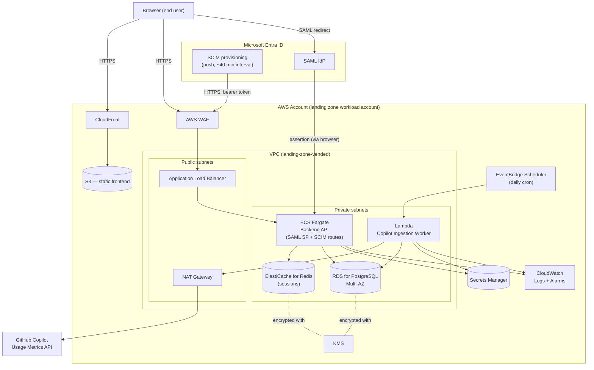

# Architecture: Phase 1 (MVP) — AWS

**Companion to:** PRD.md — scope is exactly Phase 1 from §10: Sign in, Home, My Usage, empty search state (wireframe screens 1, 2, 3, 9), daily usage ingestion, derived metrics (non-user, pace, premium-model %), basic audit log. Compare Users, Teams, Department, and alerts (Phase 2+) are out of scope for this document.

**Confirmed decisions (this revision):** hosting is AWS, deployed into the org's existing landing zone; identity provider is Microsoft Entra ID; session store is Redis (Amazon ElastiCache).

## 1. System overview



## 2. Account & network placement

- Deploy into a **dedicated workload account** provisioned through the landing zone's account factory (Control Tower / Landing Zone Accelerator), not a shared account — standard blast-radius and cost isolation for a new application.
- Use the **VPC the landing zone vends** to that account rather than hand-rolling one. Public subnets hold only the ALB and NAT Gateway; everything else (ECS tasks, RDS, ElastiCache, Lambda ENIs) sits in private subnets with no direct route to the internet.
- **Egress:** only the Ingestion Worker needs outbound internet access (to reach GitHub's API) — routed through the NAT Gateway, or through the landing zone's centralized egress path (Transit Gateway → shared egress VPC) if that's how the org centralizes outbound traffic. **Confirm which pattern your network team uses** before building — this is the one placement detail this document can't decide unilaterally.
- The Backend API needs no outbound internet route in Phase 1: SCIM arrives as inbound calls from Entra ID, and SAML assertions arrive via browser redirect, not a server-to-IdP call.

## 3. Entra ID integration specifics

- **SAML:** standard SP-initiated or IdP-initiated SSO. The Backend API's `/auth/saml/*` routes validate the assertion against Entra ID's metadata (signing cert stored in Secrets Manager) and issue a Redis-backed session.
- **SCIM is push-based, not pull.** Entra ID's provisioning service calls **our** SCIM endpoint on its own schedule (default ~40 minutes, not configurable to be faster) — we don't poll Entra ID. This means the "SCIM Sync Worker" from the earlier draft isn't a scheduled job at all; it's just more routes (`/scim/v2/Users`) on the always-on Backend API service, authenticated by a long-lived bearer token that's configured once in Entra ID's Enterprise Application "Provisioning" tab and stored in Secrets Manager on our side.
- **Only `/Users`, not `/Groups`, is needed.** Since teams are self-created in-app rather than synced from AD (PRD §6.1), we don't need Entra ID to provision groups at all — simplifies the SCIM endpoint to user CRUD only.
- Entra ID's Enterprise User schema extension (`urn:ietf:params:scim:schemas:extension:enterprise:2.0:User`) includes a `manager` attribute (a reference to another user) — this maps directly to our `users.manager_id` column, confirming that schema choice.
- Entra ID deprovisions by **PATCH-ing `active: false`**, not by hard-deleting — our SCIM handler should soft-delete (deactivate) rather than remove the row, so historical usage data stays attributable.

## 4. Data flows

1. **Identity sync (inbound push)** — Entra ID's provisioning service calls our `/scim/v2/Users` routes on its own schedule → Backend API validates the bearer token → upserts `users` (id, email, manager_id, role, active).
2. **Sign-in** — user → SAML redirect → Entra ID → assertion posted back to the Backend API's ACS endpoint → validated → Redis session created → session cookie set on the Frontend.
3. **Usage ingestion (nightly)** — EventBridge Scheduler triggers the Lambda Ingestion Worker → reads the GitHub token from Secrets Manager → calls GitHub's Copilot Usage Metrics API (via NAT Gateway) → downloads the `users-1-day` (and `users-28-day`) NDJSON reports → parses → upserts into `daily_user_usage` in RDS → computes derived metrics (non-user flag, pace, premium-model %) → writes `daily_user_derived_metrics`. Re-pulls the last ~5 days each run to absorb GitHub's ~2-day reporting lag and any late corrections.
4. **Read path** — Frontend calls the Backend API (ECS Fargate, behind the ALB) → session validated against Redis → authorization check (self, or within the caller's reporting line — recursive query over `users.manager_id`) → query RDS → audit row written → JSON response → Frontend renders Home or My Usage.

## 5. Components & responsibilities

| Component | AWS service | Responsibility |
|---|---|---|
| **Web Frontend** | S3 + CloudFront | The 4 Phase 1 screens. Talks only to the Backend API. |
| **Edge protection** | AWS WAF | Attached to both CloudFront and the ALB. |
| **Backend API** (incl. SAML SP + SCIM routes) | ECS Fargate, behind an ALB | REST endpoints for `/me`, `/home/summary`, `/users/search`, `/users/{id}/usage`, plus `/auth/saml/*` and `/scim/v2/*`. Owns authorization/scoping logic and audit logging. |
| **Session store** | ElastiCache for Redis | Server-side sessions — chosen over stateless JWTs so a session can be revoked immediately (matters for SOC 2 access-control evidence). |
| **Copilot Ingestion Worker** | Lambda, triggered by EventBridge Scheduler | The only component that calls GitHub's API. Owns NDJSON parsing and derived-metric computation. |
| **Database** | RDS for PostgreSQL, Multi-AZ | System of record: identity, usage, derived metrics, model-tier mapping, audit log. |
| **Secrets** | Secrets Manager | GitHub token, SAML cert, SCIM bearer token, DB credentials (with native RDS rotation). |
| **Encryption** | KMS | Keys for RDS, ElastiCache, S3, and Secrets Manager — landing-zone-provided CMKs where the org mandates them. |
| **Observability** | CloudWatch Logs + Alarms | App logs from ECS and Lambda; an alarm on ingestion-job failure. |

## 6. Proposed schema (Phase 1)

```
users
  id, email, display_name, manager_id (FK -> users.id, nullable),
  sso_subject, role [admin|manager|ic], active (bool), created_at, updated_at

daily_user_usage
  user_id (FK), date, ai_credits_used,
  used_completions, used_chat, used_cli, used_coding_agent, used_code_review,
  model_breakdown (JSONB — request counts per model),
  ingested_at
  PK (user_id, date)

daily_user_derived_metrics
  user_id (FK), date,
  is_non_user (bool), credits_projected, credits_allowance,
  pace_status [on_track|trending_over], premium_model_pct
  PK (user_id, date)

model_tier_mapping
  model_name (PK), tier [premium|standard], updated_at, updated_by

audit_log
  id, actor_user_id, action, target_type, target_id,
  occurred_at, metadata (JSONB)
  -- append-only: no UPDATE/DELETE grants at the DB-role level

ingestion_runs
  id, report_type, run_date, status, error_message, completed_at
  -- operational health tracking for the ingestion job
```

`daily_user_usage` and `daily_user_derived_metrics` are split so raw API data and our own computed logic can be reprocessed independently (e.g. if the model-tier mapping changes, we recompute `premium_model_pct` without re-ingesting from GitHub). `users.active` supports Entra ID's soft-delete deprovisioning (§3).

## 7. Key architecture decisions

1. **ECS Fargate for the Backend API, Lambda for ingestion.** The API is a steady, always-on REST service (and now also hosts inbound SCIM/SAML routes) — a fits container service better than a function. Ingestion is a once-daily, short-running batch job — a natural fit for Lambda + EventBridge Scheduler, no idle compute cost.
2. **SCIM is inbound-only, hosted on the same service as the API — no separate worker.** Entra ID pushes to us; there's nothing to poll and nothing that needs its own schedule.
3. **Relational DB (RDS for PostgreSQL), not a big-data store.** At 100–1,000 seats × ~90 days of daily rows, this is a few hundred thousand rows — well within normal OLTP territory.
4. **Precompute derived metrics at ingestion time, not read time.** Non-user flag, pace, and premium-model % are written by the Lambda ingestion worker, not calculated per-request — keeps API reads simple and meets the <2s p95 target.
5. **Manager-chain scoping via recursive query.** `WITH RECURSIVE` over `users.manager_id` resolves "everyone in my reporting line" on demand; only worth materializing into a closure table if it becomes a measured bottleneck.
6. **Ingestion is idempotent.** Upsert on `(user_id, date)`, always re-pulling a trailing window — makes GitHub's ~2-day reporting lag a non-issue.
7. **Server-side sessions in Redis, not JWTs.** Immediate revocation matters more here than statelessness — an offboarded or role-changed user's access should die the moment we delete their session, not wait for a token to expire.
8. **GitHub token lives only in the Ingestion Worker's Lambda role.** The Backend API's ECS task role has no access to it — separate least-privilege IAM roles per component (ECS task role: RDS + Redis + its own secrets; Lambda role: RDS + GitHub token secret + CloudWatch Logs — no overlap).
9. **Model-tier mapping is a plain admin-edited table, not a UI feature in Phase 1** — short, infrequently-changing list; a management screen can come later if it churns more than expected.

## 8. Non-functional requirements → architecture mapping (PRD §7)

| Requirement | How this architecture satisfies it |
|---|---|
| <2s p95, incl. 90-day queries | Indexed on `(user_id, date)`; derived metrics precomputed, not calculated live. |
| ~2-day data freshness, surfaced not hidden | Ingestion re-pulls a trailing window; API returns an "as of" ingestion timestamp for the UI. |
| SSO-only, no local passwords | Backend API only implements SAML against Entra ID; no password storage anywhere. |
| Least-privilege GitHub access | Only the Lambda ingestion role can read the GitHub token secret; scoped read-only to Copilot metrics. |
| Encryption at rest / in transit | TLS via ALB/CloudFront; RDS, ElastiCache, S3, and Secrets Manager all encrypted with KMS. |
| SOC 2 CC6 / audit evidence | Audit logging on every cross-user data access; `audit_log` has no update/delete grants. |
| Data minimization | Only aggregated usage metrics + identity stored — never prompt or code content. |

## 9. Confirmed stack

- **Frontend:** React + TypeScript, hosted on S3 + CloudFront, WAF attached.
- **Backend API:** ECS Fargate (container), behind an ALB — Node/TypeScript (NestJS) or Python (FastAPI); hosts REST, SAML SP, and SCIM routes.
- **Ingestion:** AWS Lambda, triggered by EventBridge Scheduler (daily).
- **Database:** Amazon RDS for PostgreSQL, Multi-AZ.
- **Session store:** Amazon ElastiCache for Redis.
- **Identity:** Microsoft Entra ID — SAML for sign-in, push-based SCIM (`/Users` only) for provisioning.
- **Secrets:** AWS Secrets Manager (GitHub token, SAML cert, SCIM bearer token, DB credentials with native rotation).
- **Encryption:** AWS KMS (landing-zone CMKs where mandated).
- **Observability:** CloudWatch Logs + Alarms.

## 10. Remaining open questions

- **Egress path:** does the landing zone route outbound traffic through a per-account NAT Gateway, or centrally via Transit Gateway to a shared egress VPC? Determines where the Ingestion Lambda's route to GitHub actually terminates — confirm with the network team.
- **CI/CD tooling:** not specified — assumed to follow whatever the org already standardizes on for container builds/deploys (e.g. CodePipeline, or GitHub Actions pushing to ECR).
- **KMS key ownership:** use landing-zone-provided CMKs, or provision app-specific keys? Depends on the org's key-management policy.
